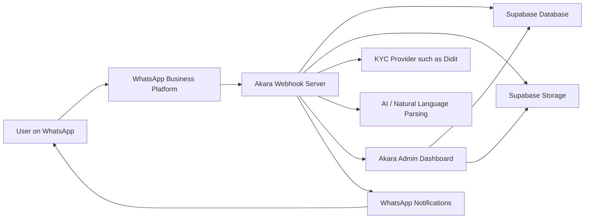

# Akara Record Of Processing Activities

This Record of Processing Activities maps how Akara collects, uses, stores, shares, and deletes personal data.

Akara should review this RoPA before production launch, after every major product change, and before adding new countries, currencies, vendors, or regulated financial features.

## Data Flow Summary

## Processing Activities

| Activity | Purpose | Data Subjects | Data Categories | Source | Legal Basis | Systems / Processors | Recipients | Retention | Cross-Border Transfer | Controls | Owner | Open Items |
| --- | --- | --- | --- | --- | --- | --- | --- | --- | --- | --- | --- | --- |
| WhatsApp onboarding and session handling | Start conversations, guide users, maintain context, route commands, show menus. | Users and prospective users. | WhatsApp number, message content, session state, command history. | User and WhatsApp. | Contract steps, legitimate interests, consent where required. | WhatsApp, Akara server, Supabase. | Akara admins where needed. | Chat records 2 years unless linked to dispute, fraud, legal, or compliance review. | Yes, depending on Meta and hosting locations. | Webhook validation, session scoping, access controls, audit logs. | Product / Engineering. | Publish WhatsApp privacy summary and opt-out language. |
| Account verification and KYC | Verify identity, prevent fraud, set account tier. | Users. | Legal name, nationality, residence, city, ID document, selfie, liveness metadata, verification status. | User, KYC provider, admin reviewer. | Contract, legal obligation, legitimate interests, consent where required. | Didit or KYC provider, Supabase Storage, admin dashboard. | Admin reviewers, KYC provider. | KYC records 5 years after account closure or last transaction unless law requires longer. | Yes, depending on vendor. | Restricted storage, signed URLs, admin review, tier limits, name matching. | Compliance / Admin. | Finalise KYC vendor DPA and biometric consent wording. |
| Payout detail setup and name match | Let users receive peer payments safely and verify payout ownership. | Users. | Bank name, account number, account name, mobile money network, phone number, currency. | User and, later, account validation provider. | Contract, legitimate interests, fraud prevention. | Akara server, Supabase. | Trade counterparty only when trade opens. | 5 years if linked to trades or compliance records. | Yes, if hosted outside country. | Strict name match, passcode for edits, admin review for mismatch, no third-party accounts. | Product / Compliance. | Add API validation when available. |
| Listing creation and share cards | Let users publish available exchange terms and share listing cards. | Users. | Amounts, currencies, terms, listing reference, share link. | User. | Contract, legitimate interests. | Akara server, Supabase, card generator, WhatsApp. | Other users who browse or open listing. | Listing records 5 years if linked to trades, otherwise product retention schedule. | Yes. | Duplicate listing checks, user ownership checks, card regeneration on edits. | Product / Engineering. | Define retention for inactive listings not tied to trades. |
| Offer search and browse | Show available peer-listed offers. | Users. | Search text, currencies, amounts, listing results, user account status. | User and listings database. | Contract steps, legitimate interests. | Akara server, Supabase, AI parsing. | User requesting offers. | Session/search logs 2 years unless linked to dispute or fraud. | Yes. | Natural language parser, scope limitation, no unnecessary KYC exposure in listings. | Product. | Confirm if search analytics will be retained separately. |
| Trade opening and payment coordination | Open a time-limited trade and show payment instructions. | Trade parties. | Trade reference, amounts, currencies, payout details, payment status, expiry, participant IDs. | Users and Akara system. | Contract, legitimate interests, fraud prevention. | Akara server, Supabase, WhatsApp. | Trade counterparties. | Trade records 5 years. | Yes. | Verification gate, payout name match, payment window, status tracking, no custody. | Product / Compliance. | Add stronger anti-self-trading checks. |
| Receipt and evidence handling | Confirm payment claims, support disputes, reduce fraud. | Trade parties. | Receipt image/PDF, SMS confirmation, screenshot, payment metadata, upload timestamp. | User. | Contract, legitimate interests, legal obligation where required. | WhatsApp media API, Supabase Storage, admin dashboard. | Counterparty and admin reviewers where needed. | 5 years. | Yes. | Mandatory receipt after paid status, restricted file access, evidence integrity checks. | Compliance / Support. | Add OCR or receipt consistency checks later. |
| Dispute management and admin resolution | Resolve failed, delayed, disputed, or suspicious trades. | Trade parties. | Dispute reason, description, supporting documents, receipts, admin notes, outcome. | User, counterparty, admin. | Contract, legitimate interests, legal obligation. | Akara server, Supabase, admin dashboard, WhatsApp. | Parties to trade, admin reviewers, authorities if required. | 5 years. | Yes. | Mandatory description and evidence, admin outcome, user notifications, audit logs. | Compliance / Admin. | Finalise dispute SLA and outcome taxonomy. |
| Fraud and risk monitoring | Detect fake receipts, duplicate accounts, self-trading, abuse, suspicious patterns. | Users and counterparties. | Phone number, device/session signals where available, trade history, receipts, cancellations, flags. | Akara system, users, admin. | Legitimate interests, legal obligation where required. | Akara server, Supabase, admin dashboard. | Admin reviewers. | 5 years where linked to risk or fraud. | Yes. | Rate limits, duplicate detection, tier limits, suspensions, audit logs. | Compliance / Engineering. | Define exact duplicate account signal policy. |
| Support and complaints | Respond to support messages, complaints, appeals, and questions. | Users and complainants. | Contact details, messages, attachments, complaint notes, resolution. | User and support team. | Contract, legitimate interests, legal obligation. | WhatsApp, email, support tools. | Support team, admin reviewers. | 5 years for complaints, or longer where legally required. | Yes depending on support vendor. | Access control, response SLA, escalation email, complaint log. | Support. | Select final support tooling. |
| Admin operations and audit logs | Let authorised admins review users, disputes, KYC, tiers, restrictions. | Users, admins. | Admin identity, action logs, affected user ID, review notes, timestamps. | Admin dashboard. | Legitimate interests, legal obligation, security. | Admin dashboard, Supabase. | Internal authorised admins. | 5 years. | Yes. | Least privilege, audit logging, role separation, protected credentials. | Engineering / Compliance. | Add admin role matrix and periodic access review. |
| Website analytics and marketing | Measure website use and improve landing pages, if enabled. | Website visitors and leads. | Cookie IDs, IP-derived location, device data, page events, waitlist or support form data. | Website visitor. | Consent where required, legitimate interests where allowed. | Website host, analytics vendor, email provider. | Akara marketing/support. | Analytics retention based on vendor settings; marketing opt-out retained as needed. | Yes. | Cookie notice, opt-out, minimisation, vendor DPA. | Marketing / Product. | Confirm analytics vendor and cookie settings. |
| Data subject rights and deletion | Handle access, correction, deletion, restriction, objection, portability, consent withdrawal. | Users. | Request details, identity confirmation, action taken, refusal reason where applicable. | User and Akara records. | Legal obligation. | Support, admin dashboard, Supabase. | User, authorised admin. | Rights request log 5 years. | Yes. | 30-day target, active dispute/fraud hold, audit record. | Privacy Lead. | Build self-serve export/delete controls later. |

## Data Inventory

| Data Category | Examples | Sensitivity | Primary Storage |
| --- | --- | --- | --- |
| Account data | Name, WhatsApp number, country, city, tier. | Medium. | Supabase database. |
| KYC data | ID document, selfie, liveness result. | High. | KYC provider and restricted storage. |
| Payout data | Bank account, mobile money number, account name. | High. | Supabase database. |
| Trade data | Listing, trade, amount, currency, status. | Medium to high. | Supabase database. |
| Receipts and disputes | Payment proof, screenshots, dispute notes. | High. | Restricted storage and database. |
| Admin audit data | Admin actions, review notes, timestamps. | Medium to high. | Supabase database. |
| Website data | Analytics and forms where enabled. | Low to medium. | Website and analytics vendors. |

## Review Checklist

- Confirm every processing activity has a named owner.
- Confirm every vendor has a contract and DPA.
- Confirm sensitive data has restricted access and audit logs.
- Confirm retention rules are technically implemented.
- Confirm deletion requests are blocked during active disputes or fraud review.
- Confirm legal pages match this RoPA.
- Confirm new product features are added to this RoPA before release.
